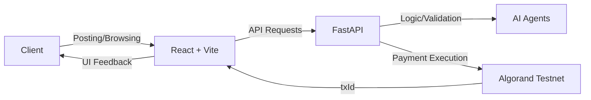

# 🤖 AgentHire

### **The Future of Work: AI-Driven Freelance Hiring on the Blockchain**

[](https://react.dev/)
[](https://fastapi.tiangolo.com/)
[](https://www.algorand.com/)
[](#license)

---

## 🌍 The Real-World Problem

The global freelance economy is booming, yet it remains plagued by three critical issues:
1. **Trust Deficit:** Skill verification is manual, tedious, and often unreliable.
2. **Payment Fraud:** Traditional platforms charge exorbitant fees and delay payouts, leaving freelancers vulnerable.
3. **Inefficiency:** Matching the right talent with the right project is still a "guess-and-check" game.

**AgentHire** addresses these pain points by combining the cognitive power of **AI Agents** with the immutable security of the **Algorand Blockchain**.

---

## 💡 The Solution

AgentHire is a decentralized freelance hiring portal that automates trust and streamlines payments. 
- **AI Synergy:** Intelligent agents analyze freelancer profiles and project requirements to ensure a perfect match.
- **Blockchain Security:** Payments are handled via Algorand, ensuring near-instant finality and minimal transaction costs.
- **Automated Validation:** Before a hire is finalized, an AI agent validates the freelancer’s credentials, reducing the risk of bad hires.

---

## 🏗️ Architecture Overview

The system is designed for high performance and scalability:



---

## ⚙️ Tech Stack

### **Frontend**
- **React (Vite):** Blazing fast development and optimized production builds.
- **TypeScript:** Ensuring type safety and maintainability.
- **Tailwind CSS:** For a modern, responsive, and premium UI.
- **Lucide React:** Beautiful, consistent iconography.

### **Backend**
- **FastAPI:** High-performance Python framework for building robust APIs.
- **Pydantic:** Data validation and settings management.
- **Python:** The backbone of our AI and business logic.

### **Blockchain**
- **Algorand SDK:** Interacting with the Algorand blockchain.
- **Testnet:** Used for secure, cost-free transaction testing.

---

## 🔥 Key Features

- 🎯 **AI-Powered Freelancer Selection:** Get the best candidate matched by data, not just keywords.
- 🔐 **Secure Blockchain Payments:** Eliminate intermediaries and ensure freelancers get paid instantly.
- 📊 **Real-Time Transaction Tracking:** View the status of your payments directly on the Algorand explorer.
- 🤖 **Agent-Based Validation:** Intelligent agents perform sanity checks on freelancer data before any contract is signed.

---

## 🧪 How It Works (User Flow)

1. **Job Description:** The client enters project details.
2. **AI Matching:** The system recommends the top-rated freelancers for the specific task.
3. **Agent Validation:** An AI Agent validates the selected freelancer's previous project history.
4. **Blockchain Hire:** Clicking "Hire" triggers an Algorand transaction.
5. **Confirmation:** The transaction ID (txId) is returned and displayed, confirming the secure hire on-chain.

---

## 🚀 Getting Started

### **Prerequisites**
- Node.js (v18+)
- Python (3.9+)
- Pnpm (recommended) or npm/yarn
- Algorand Testnet Account (to interact with payments)

### **Installation**

1. **Clone the repository:**
   ```bash
   git clone https://github.com/yourusername/AgentHire.git
   cd AgentHire
   ```

2. **Frontend Setup:**
   ```bash
   cd frontend
   pnpm install
   ```

3. **Backend Setup:**
   ```bash
   cd ../backend
   pip install -r requirements.txt
   ```

### **Running Locally**

1. **Start the Backend:**
   ```bash
   cd backend
   uvicorn main:app --reload
   ```

2. **Start the Frontend:**
   ```bash
   cd frontend
   pnpm run dev
   ```

---

## 🌐 Deployment

- **Frontend:** Deployed on **Vercel** for optimal global delivery.
- **Backend:** Hosted on **Render** (or equivalent) for reliable API performance.
- **Blockchain Connectivity:** Local backend bridged via **ngrok** during development to interact with live webhooks.

---

## 📸 Screenshots / Demo

> [!NOTE]
> Add your stunning UI screenshots here!

| **Dashboard** | **Freelancer Selection** |
| :---: | :---: |
|  |  |

### **Demo Video**
[Watch the AgentHire Demo](https://link-to-your-video.com)

---

## 🛠️ Challenges Faced

- **Blockchain Integration:** Synchronizing the fast-paced React UI with Algorand's transaction confirmation cycles.
- **State Management:** Keeping the agent's validation status in sync across the distributed architecture.
- **Deployment Coordination:** Managing CORS and environment variables across multiple hosting platforms (Vercel/Render).

---

## 🚀 Future Scope

- [ ] **Smart Contract Escrow:** Automated fund release based on milestone completion.
- [ ] **On-Chain Reputation System:** Immutable ratings for every freelancer.
- [ ] **DAO Governance:** Letting the community vote on platform upgrades.
- [ ] **Multi-Chain Support:** Expanding beyond Algorand to other fast, low-cost chains.

---

## 👥 Meet the Team

| Team Member | Role | Socials |
| :--- | :--- | :--- |
| **[Your Name]** | Lead Developer | [GitHub](https://github.com/) / [LinkedIn](https://linkedin.com/) |
| **[Partner Name]** | Product Design | [GitHub](https://github.com/) / [LinkedIn](https://linkedin.com/) |

---

## ⭐ Support the Project

If you believe in the future of decentralized work, give AgentHire a star! ⭐

---

### **License**
This project is licensed under the MIT License - see the [LICENSE](LICENSE) file for details.
